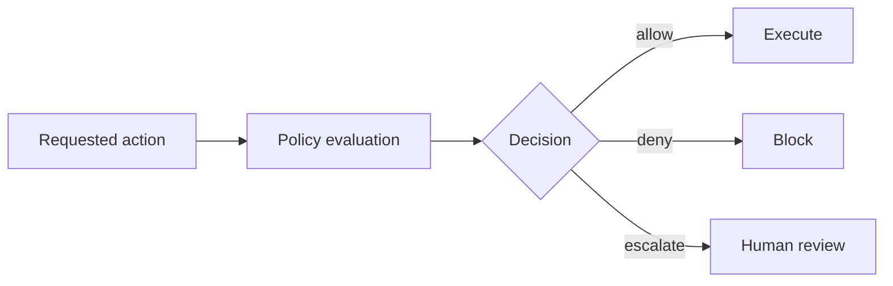
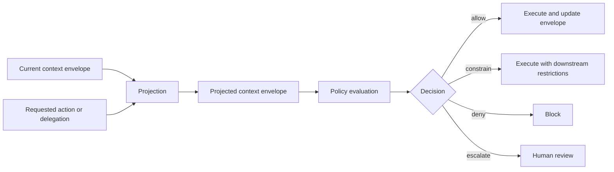
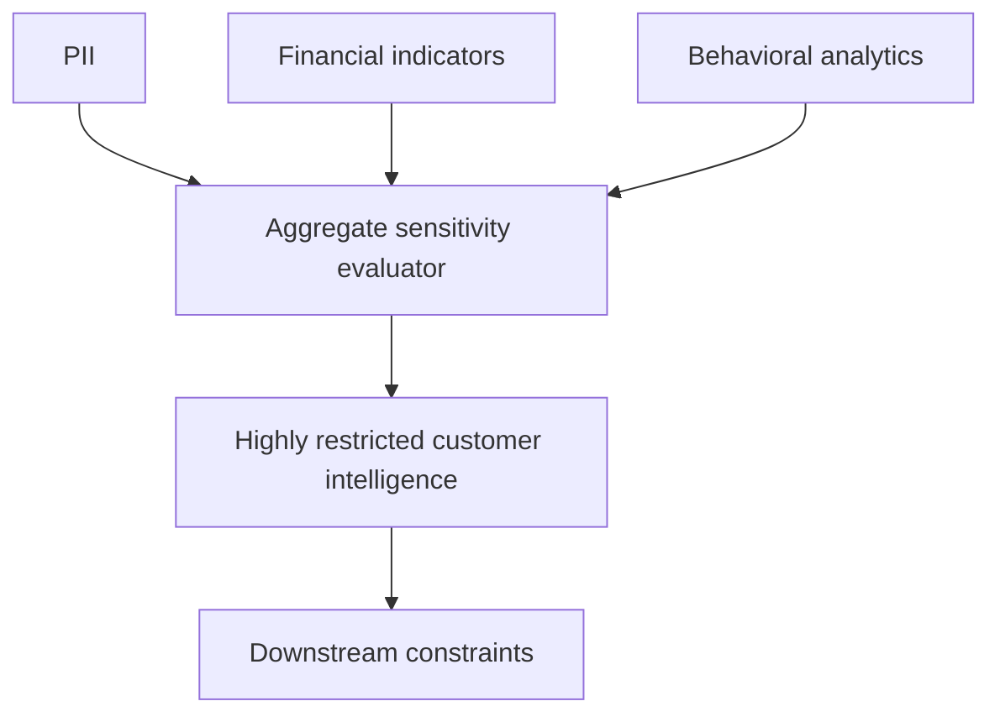
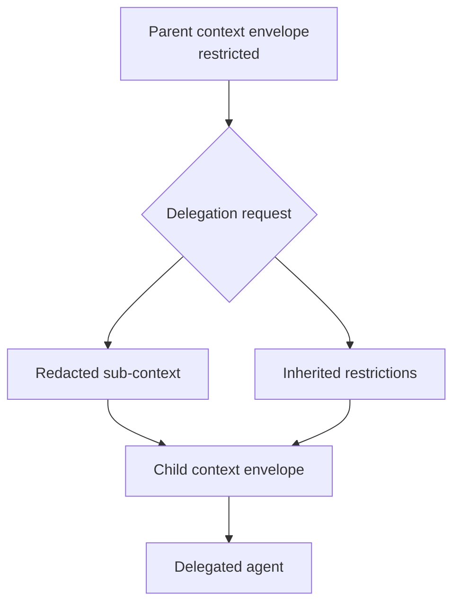
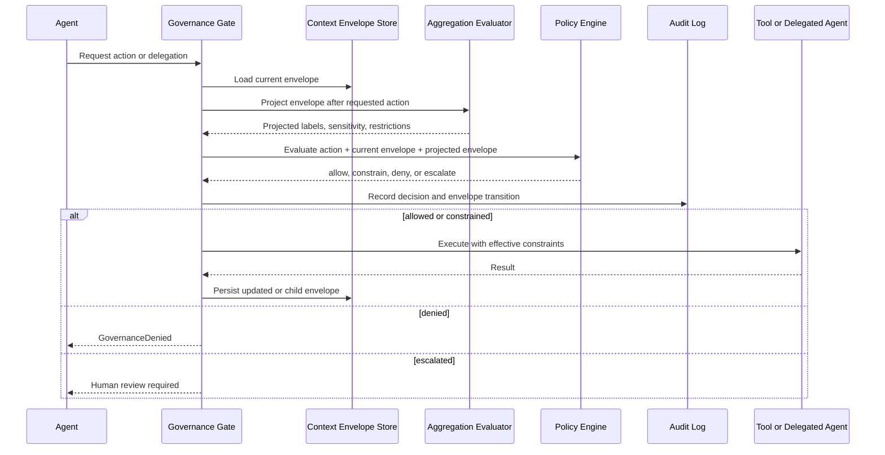
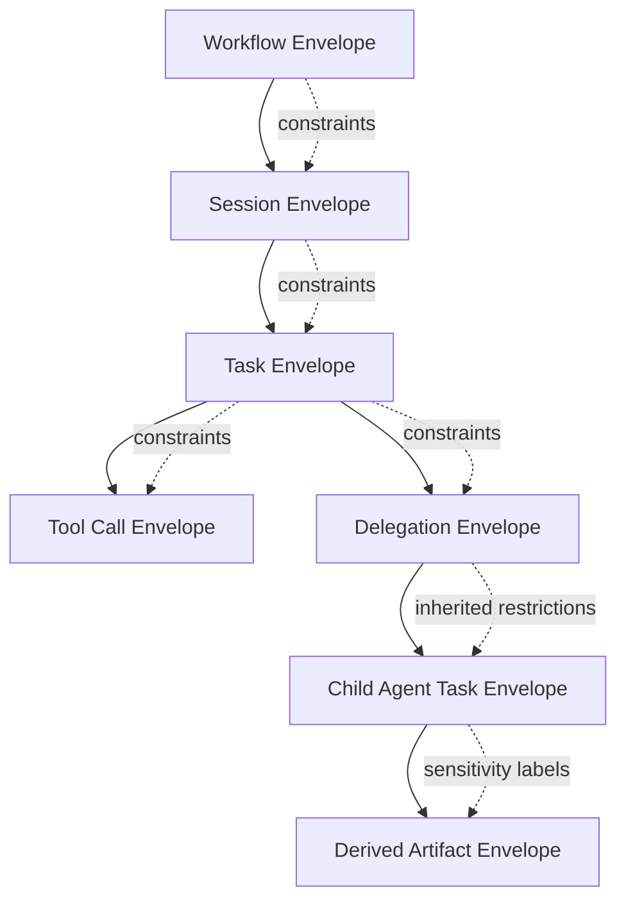
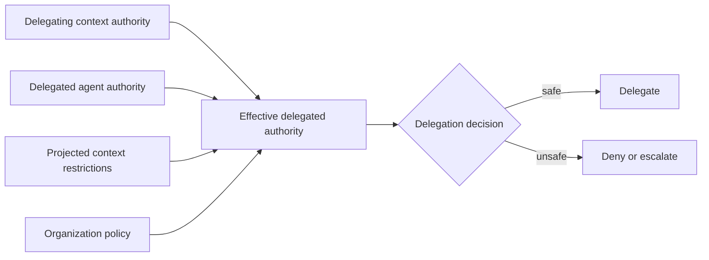

# ADR: Context Accumulation Governance for Delegated Agent Workflows

**Status:** Proposed  
**Date:** 2026-06-03  
**Scope:** Agent OS, Agent Mesh, Audit/Compliance, Policy Evaluation, Delegation Governance  
**Related:** AUDIT-COMPLIANCE-1.0, data-layer ABAC, dynamic policy conditions, delegation/audit lineage

---

## Context

AGT already governs individual actions through policy evaluation, audit logging, data classification, trust, identity, and tool/runtime interception. Those controls are necessary, but they mostly evaluate requests as discrete events.

A multi-agent workflow can remain compliant at each individual step while still becoming unsafe through aggregation.

Examples:

- A customer name is low sensitivity.
- Renewal status is moderate sensitivity.
- Usage analytics are moderate sensitivity.
- Support records are moderate sensitivity.
- Financial indicators are moderate sensitivity.

Combined, those elements may produce a highly sensitive customer risk profile, especially if the agent derives conclusions such as likely churn, financial distress, account vulnerability, or recommended commercial pressure.

This creates a governance gap:

> The policy engine may approve every individual action while the accumulated context crosses a sensitivity boundary.

That gap becomes sharper when agents delegate work. A delegated agent may receive only a harmless-looking subtask, but the parent workflow may already carry constraints that must follow the delegated context.

---

## Decision

Introduce a design model for **Context Accumulation Governance**.

The model treats context as a governed state that evolves during a workflow. Governance decisions should evaluate not only the requested action, but also the projected context state after that action succeeds.

Traditional model:



Proposed model:



The key architectural change is that governance must become context-aware across the life of a task, session, delegation chain, or workflow.

---

## Core Concepts

### Context Envelope

A context envelope is a structured record of accumulated governance state.

It may be attached to a session, task, tool invocation sequence, delegation chain, or derived artifact.

Example:

```json
{
  "context_envelope_id": "env_01JZ4A9K2M",
  "parent_context_envelope_id": "env_01JZ49Y8ND",
  "workflow_id": "wf_123",
  "agent_id": "agent.customer-success",
  "labels": ["pii", "financial", "behavioral"],
  "aggregate_sensitivity": "restricted",
  "derived_sensitivity": ["customer-risk-profile"],
  "delegation_depth": 2,
  "restrictions": [
    "no_external_delegation",
    "no_external_export",
    "no_memory_write"
  ],
  "created_at": "2026-06-03T12:00:00Z"
}
```

### Aggregate Sensitivity

Aggregate sensitivity is the sensitivity created by combining otherwise permissible inputs.

Example:



The framework should not prescribe every possible aggregation rule. Organizations should define mappings based on their own policy requirements.

AGT can define the envelope model and evaluation hooks.

### Derived Sensitivity

Derived sensitivity applies to conclusions or generated artifacts produced from source data.

Examples:

- Customer likely to churn within 30 days
- Employee likely to leave
- Patient likely has a condition
- System likely has a security weakness
- Account likely has financial distress

This matters because a derived artifact may be more sensitive than any single source input.

### Delegation Constraints

Context envelopes may constrain downstream delegation.

A delegated agent should not receive a less restrictive context envelope than the parent workflow permits.

Safe delegation may reduce the data payload, but it must not silently strip restrictions.



---

## Governance Invariants

1. **Delegation cannot expand effective authority.**
   A delegated agent may only exercise authority permitted by both the delegating context and the delegated agent's own authority.

2. **Restrictions ratchet upward unless explicitly declassified.**
   Once context sensitivity increases, downstream restrictions must persist unless a governed declassification step occurs.

3. **Aggregation may change classification.**
   Multiple permitted inputs may create a restricted aggregate.

4. **Derived artifacts are governed artifacts.**
   Inferences, predictions, summaries, scores, and profiles can carry sensitivity labels.

5. **Context reduction must be explicit.**
   Redaction, summarization, minimization, or transformation must create a new child envelope that records what was removed and which restrictions remain.

6. **No downstream context may become less restrictive by accident.**
   Any relaxation must be policy-authorized, auditable, and explainable.

---

## Process Flow



---

## Context Hierarchy



This hierarchy is conceptual. Implementations may flatten it, but the governance semantics should preserve lineage and inherited constraints.

---

## Example Policy Shape

This ADR does not require a specific policy language. The following is illustrative only.

```yaml
context_aggregation:
  rules:
    - name: pii_financial_is_restricted
      when:
        all_labels: [pii, financial]
      set:
        aggregate_sensitivity: restricted
        restrictions:
          - no_external_delegation
          - no_external_export

    - name: pii_financial_behavioral_is_highly_restricted
      when:
        all_labels: [pii, financial, behavioral]
      set:
        aggregate_sensitivity: highly_restricted
        restrictions:
          - no_external_delegation
          - no_external_export
          - no_memory_write
          - human_approval_for_derived_profiles

    - name: derived_customer_risk_profile
      when:
        derived_artifact_type: customer-risk-profile
      set:
        derived_sensitivity:
          - customer-intelligence
        restrictions:
          - no_external_export
          - audit_required
```

---

## Integration Points

### Agent OS

Agent OS can evaluate current and projected context as part of policy evaluation.

Potential additions:

- `ContextEnvelope`
- `ContextProjection`
- `ContextAggregationRule`
- `ContextConstraint`
- `ContextEnvelopeEvaluator`

### Agent Mesh

Agent Mesh can carry context envelopes across delegation boundaries.

Potential additions:

- Delegation envelope IDs
- Parent/child context references
- Inherited constraint propagation
- Effective authority intersection

### Audit and Compliance

Audit entries should record context transitions.

Potential event kinds:

- `CONTEXT_ENVELOPE_CREATED`
- `CONTEXT_ENVELOPE_UPDATED`
- `CONTEXT_AGGREGATION_ELEVATED`
- `CONTEXT_DELEGATED`
- `CONTEXT_REDACTED`
- `CONTEXT_DECLASSIFICATION_REQUESTED`
- `CONTEXT_DECLASSIFICATION_APPROVED`
- `DERIVED_ARTIFACT_LABELED`

Example event shape:

```json
{
  "event_type": "CONTEXT_AGGREGATION_ELEVATED",
  "agent_id": "agent.customer-success",
  "context_envelope_id": "env_01JZ4A9K2M",
  "previous_sensitivity": "confidential",
  "new_sensitivity": "restricted",
  "labels_added": ["financial"],
  "rules_applied": ["pii_financial_is_restricted"],
  "restrictions_added": ["no_external_export"],
  "decision": "constrain"
}
```

---

## Authority Intersection

Delegated authority should be calculated as the intersection of:

1. The delegating context's permitted authority
2. The delegated agent's own authority
3. The projected context restrictions
4. Organization policy



This prevents authority laundering, where an agent delegates work to another agent with broader access in order to bypass restrictions.

---

## Consequences

### Benefits

- Closes the gap between action-level policy and workflow-level risk.
- Improves governance for multi-agent delegation.
- Allows sensitivity to reflect accumulated knowledge rather than isolated data access.
- Makes derived intelligence auditable.
- Provides a foundation for future information-flow controls.
- Preserves policy-engine neutrality by supplying structured context rather than replacing Cedar, OPA, ABAC, or YAML rules.

### Tradeoffs

- Requires tracking context state across actions.
- Adds complexity to delegation and audit flows.
- Requires careful schema design to avoid policy ambiguity.
- May create excessive escalation if aggregation rules are too broad.
- Requires explicit declassification/minimization semantics to avoid permanent over-restriction.

### Risks

- Poorly designed aggregation rules could create false positives.
- Weak derived-sensitivity detection could miss sensitive inferences.
- Excessive restriction inheritance could reduce usability.
- Context envelopes could themselves become sensitive artifacts requiring protection.

---

## Non-Goals

- This ADR does not define a complete implementation.
- This ADR does not replace existing policy engines.
- This ADR does not prescribe universal risk scores.
- This ADR does not require a centralized context store.
- This ADR does not require all AGT components to adopt context envelopes at once.

---

## Implementation Path

1. Define a framework-neutral `ContextEnvelope` schema.
2. Add context envelope references to audit events.
3. Define aggregation evaluation hooks.
4. Add test fixtures for sensitivity aggregation.
5. Add delegation propagation examples.
6. Add one reference policy example.
7. Evaluate whether Agent Mesh or Agent OS should own the first implementation.

---

## Open Questions

1. Should context envelopes be immutable, versioned, or mutable with audit transitions?
2. Should context projection happen before or inside policy evaluation?
3. Should derived sensitivity be declared by tools, inferred by classifiers, or both?
4. Should context envelopes attach to sessions, tasks, delegation chains, or all three?
5. How should context declassification be authorized?
6. Which component should own envelope propagation across Agent Mesh boundaries?
7. Should AGT define standard event kinds for context transitions?
8. Should context envelope IDs be included in `agt-evidence.json` receipts?

---

## Summary

Context Accumulation Governance extends AGT's action-level controls into workflow-level information governance.

It asks one additional question before allowing an action or delegation:

> What will this agent become capable of knowing or doing after this action succeeds?

That question is necessary for delegated multi-agent systems where individually safe actions can produce collectively sensitive outcomes.
